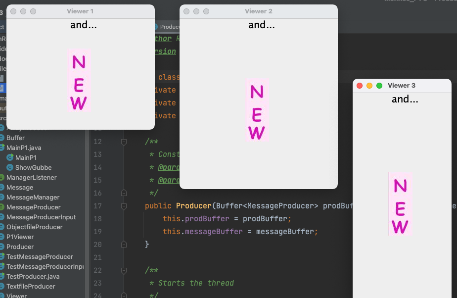
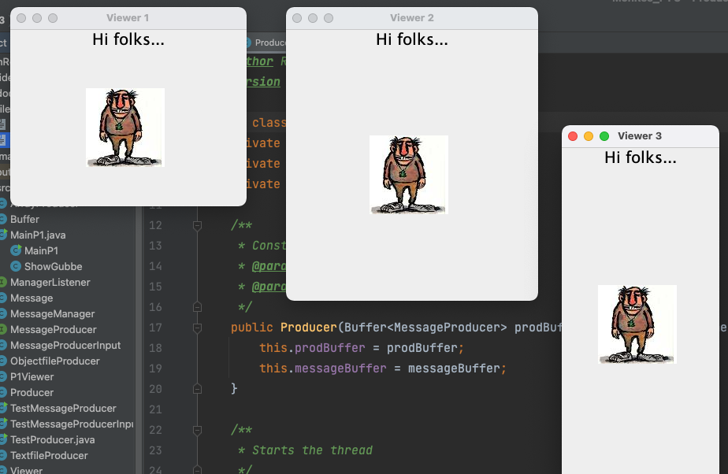

# Images to Animation
This program reads from a text file (new.txt) using threads. 
The delays and the times the reading process is repeated make it to be viewed as an animation. 

Example from the first animation:

Here is another one:

